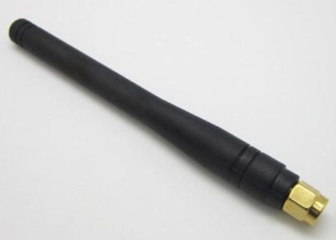
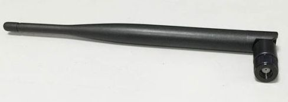

# OGN-Airtracker

Live plane tracker based on [Open Glider Network project](http://www.glidernet.org/).

## Hardware

Hardware is a flavor of the [Cheap Do-It-Yourself OGN tracker](http://wiki.glidernet.org/ogn-tracker-diy).

The latest version OGN-Airtracker assembly contains:

* STM32F103C8T6 CPU board with ARM STM32 Cortex-M3 CPU
  [@eBay](http://www.ebay.com/itm/321569700934)
* HOPERF RFM69HW transceiver
  [@Anarduino](http://www.anarduino.com/miniwireless/)
* SMA-female socket with pigtail
* 50 ohm antenna with SMA-male right angle connector
  [@AliExpress](http://www.aliexpress.com/item/NiceRF-Rubber-Antenna-SW868-WT100-Wireless-RF-Antenna-868MHz/32319847439.html)
  \- see Antenna section below
* adhesive copper foil tape for antenna counter-weight *if needed* as some of those short rubber/whip
    antennas are 1/4 wave monopoles and require ground plane for proper work)
    [@eBay](http://www.ebay.com/itm/161170293355)
* VK2828U7G5LF GPS module
  [@eBay](http://www.ebay.com/itm/251959460965)
* LCD for Nokia 5110
  [@eBay](http://www.ebay.com/itm/221475096725)
* 18650 Li-Ion cell battery
* Micro USB 18650 Lithium Battery Charging Board with undervoltage protection
  [@eBay](http://www.ebay.com/itm/251888669022)
* 18650 battery holder
  [@eBay](http://www.ebay.com/itm/361262848840)
* Toggle on/on switch
  [@eBay](http://www.ebay.com/itm//111624235328)
* Some female to female dupont jumper wire cables
  [@eBay](http://www.ebay.com/itm/390925108344)
* Some toroidal ferrite rings for EMC filtering
  [@eBay](http://www.ebay.com/itm/271876448943)

### Antenna

*Disclaimer: First, I've to say, I'm an amateur in this field. Not a radio amateur, but real amateur. So some conclusions below can be pure nonsense.*

I recommend look at really nice [Understanding Antenna Specifications and Operation](http://www.digikey.com/en/articles/techzone/2011/mar/understanding-antenna-specifications-and-operation) paper by Linx Technologies.
Also [ANTENNAS APPLICATIONS FOR RF MODULE](http://www.hoperf.com/upload/rf/ANTENNAS_MODULE.pdf) by HOPERF is informative.

What I've learned:
* 1/4 wave antennas require ground plane to work correctly
  * The ground plane's size and orientation has quite an influence on the antenna performace
  * For example *horizontal ground plane with antena orthogonally above will radiate above ground plane only*
    (this is usually not wanted for things flying above groud-based receiver antenna -
    unless we turn the aircraft or at least the antenna upside down, but in this case air-to-air communication
    is still influenced)

* For the best perfomance and the easiest installation the *full dipole antenna is the best choice* IMHO
  (of course vertically mounted for required polarization) and *no copper foil* into the case

* I've bought a noname "10cm rubber antenna" thinking it will be better than those 1/4 wave antennas
  in a shorter housing.

  
  * After removing the plastic housing, I've realized that it's just a 1/4 wave coil which
    could easily fit into a housing of a half length
  * So this antenna type would *require a good ground plane*

* I've also bought "21cm 3dB antenna"

  
  * This one has a whip style center-fed dipole antenna inside
  * Such antenna doesn't require a ground plane, moreover according to papers mentioned,
    the *ground plane can negatively influence antenna performace* (narrowing or widening bandwidth,
    shifting resonant frequency, increasing SWR, affect radiation pattern reflections)

### Power supply

Approximate power consumptions:
* STM32 max 50mA@72MHz
* RFM69HW Tx 95mA/+17dBm
* GPS max 67mW (20mA@3.3V)
* LCD max 300uA

* Total is cca max 165.3mA@3.3V

Regulator on STM32F103C8T6 CPU board:
* DE=A1D - probably kind of RT9193-33:
* Iout max 300mA
* Vin 2.5 - 5.5V
* dropout 220mV@300mA
* low noise typ. 100uVRMS 10Hz - 100kHz @200mA

* Avoiding other more or less noisy switching regulators, the integrated one should
  have enough power for all the peripherals and can be connected to 18650 battery
  (through an undervoltage battery protection circuit).

## Software

Software is a fork of the [Cheap Do-It-Yourself OGN tracker sw](https://github.com/glidernet/diy-tracker)
enhanced with LCD display and buttons control.

For now in [separate module](https://github.com/peclik/diy-tracker/tree/lcd).

Build with LCD support:
* `make "WITH_OPTS=lcd5110 buttons"`

## Case

See [case folder](case/readme.md).

## License

The code is copyrighted by Open Glider Network developers including:
* [Richard Pecl](https://github.com/peclik)
* [Paweł Jałocha](https://github.com/pjalocha)
* [Wojtek Buczak](https://github.com/wbuczak)

The code is licensed under a [GNU General Public License Version 3](http://www.gnu.org/licenses/gpl-3.0.html).

Case designs are created by:
* [Richard Pecl](https://github.com/peclik)

The designs are licensed under a [Creative Commons
  Attribution-ShareAlike 4.0 International License](http://creativecommons.org/licenses/by-sa/4.0/).
